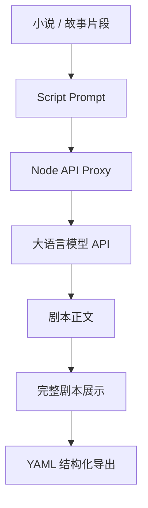

# StoryFlow AI

**基于大语言模型的 AI 小说转剧本创作平台**
## 🎬 项目演示视频（Demo Video）

演示视频一https://www.bilibili.com/video/BV1fEEh6KESg/
演示视频二https://www.bilibili.com/video/BV1fEEh6KESg/


## 项目简介

基于多Agent工作流的AI小说转剧本平台

StoryFlow AI 是一个面向编剧、短剧创作者和自媒体团队的 AI 创作工具。用户可以输入小说章节、故事梗概或剧情片段，系统会基于大语言模型生成可继续编辑和打磨的剧本初稿。

平台围绕“小说到剧本”的核心链路设计，支持人物表、章节识别、场景拆分、动作描写、对白设计、标准剧本格式和结构化 YAML 导出，帮助创作者提升从长文本故事到影视短剧初稿的生产效率。

## 核心功能

### 小说转剧本

支持输入：

- 小说章节
- 剧情大纲
- 故事片段
- 3 个章节以上的长文本小说

支持输出：

- 人物表
- 章节级结构化结果
- 场景划分
- 动作描写
- 对白设计
- 标准剧本格式
- 结构化 YAML 剧本

### 章节识别与长文本处理

StoryFlow AI 支持识别常见章节标题，例如：

- 第一章
- 第1章
- Chapter 1
- 第二章 / 第三章 / 第〇章

当输入内容包含 3 个及以上章节时，工作台会提示已识别章节数量，并按章节组织剧本初稿。若未检测到明确章节标题，系统会按段落自动拆分，保证长文本仍可进入改编流程。

### AI 剧本生成

基于兼容 OpenAI API 规范的大语言模型生成剧本内容。当前支持 DeepSeek，后续可扩展 GPT、Claude、Gemini 等模型。

支持：

- 短剧改编
- 网文改编
- 剧情重构
- 对白优化
- 正式影视剧本格式输出

当前主链路聚焦“小说输入 → 剧本生成 → 完整剧本展示”，增强分析能力按需触发，不阻塞剧本生成。


### YAML 结构化导出

工作台和原著对照页均支持导出结构化 YAML 文件，文件名为：

```text
storyflow-screenplay.yaml
```

YAML 会保留：

- 作品标题
- 原始内容类型
- 章节数量
- 人物表
- 章节结构
- 场次列表
- 动作描写
- 对白
- 场次目的

YAML Schema 文档见：[docs/yaml-schema.md](docs/yaml-schema.md)

### Prompt Engine

StoryFlow AI 内置剧本改编提示词系统，用于控制模型输出结构和剧本质量。

支持：

- 剧情压缩
- 节奏控制
- 人物保留
- 风格调整
- 专业剧本格式约束
- 章节级剧本结构化转换

### 可扩展分析模块

除主剧本生成链路外，系统保留按需生成的扩展能力：

- 人物情感宇宙
- 平台适配分析
- 导演审查建议
- 改写建议

这些能力默认不阻塞剧本生成，创作者可在需要时单独触发。

## 技术架构

### 前端

- React
- Vite
- Tailwind CSS
- react-router-dom
- lucide-react

### 后端

- Node.js
- Express
- 本地 Node API Proxy

### AI 能力

- 兼容 OpenAI API 规范的大语言模型调用能力
- 当前支持 DeepSeek
- 后续可扩展 GPT、Claude、Gemini 等模型
- Prompt Engineering

### 工程化

- Git
- GitHub
- `.env.local` 本地密钥管理
- `.env.example` 配置模板

## 项目结构

```text
StoryFlow-AI/
├─ docs/
│  ├─ yaml-schema.md              # YAML Schema 设计文档
│  └─ history/                    # 项目阶段记录
├─ server/
│  ├─ index.js                    # 本地 Node API Proxy
│  └─ utils/
│     └─ jsonGuard.js             # 大模型 JSON 返回兜底解析
├─ src/
│  ├─ agents/                     # 本地演示模式 Agent
│  ├─ components/                 # 通用组件与布局
│  ├─ context/
│  │  └─ StoryContext.jsx         # 全局状态管理
│  ├─ data/                       # 示例小说与本地演示数据
│  ├─ pages/                      # 页面模块
│  │  ├─ Home.jsx
│  │  ├─ Studio.jsx               # 工作台
│  │  ├─ Characters.jsx
│  │  ├─ Rewrite.jsx
│  │  ├─ Comparison.jsx
│  │  ├─ ReviewReport.jsx
│  │  └─ SchemaDoc.jsx
│  ├─ prompts/                    # Prompt Engine
│  ├─ routes/
│  │  └─ AppRoutes.jsx
│  ├─ services/
│  │  └─ aiClient.js              # 前端 AI 请求客户端
│  ├─ utils/
│  │  ├─ chapterParser.js         # 章节识别与长文本切分
│  │  ├─ screenplayFormatter.js   # 剧本格式化与导出工具
│  │  └─ yamlFormatter.js         # YAML 结构化导出工具
│  ├─ App.jsx
│  ├─ index.css
│  └─ main.jsx
├─ .env.example
├─ package.json
├─ vite.config.js
└─ README.md
```

## 快速启动

安装依赖：

```bash
npm install
```

启动前端：

```bash
npm run dev
```

启动本地 API Proxy：

```bash
npm run server
```

同时启动前端和后端：

```bash
npm run dev:all
```

生产构建：

```bash
npm run build
```

## 环境变量配置

复制环境变量模板：

```bash
cp .env.example .env.local
```

在 `.env.local` 中配置：

```env
USE_MOCK=false
DEEPSEEK_API_KEY=your_deepseek_api_key
DEEPSEEK_MODEL=deepseek-chat
DEEPSEEK_BASE_URL=https://api.deepseek.com
```

说明：

- `USE_MOCK=true`：启用本地演示模式，用于离线演示和稳定验证。
- `USE_MOCK=false`：启用真实模型模式，通过本地 Node API Proxy 调用大语言模型。
- API Key 只应存放在 `.env.local`，不要提交到 GitHub。
- 前端不会直接暴露模型 API Key。

## 运行模式

- **本地演示模式**：使用内置数据快速体验流程，适合无网络或稳定演示场景。
- **真实模型模式**：通过本地 Node API Proxy 调用兼容 OpenAI API 规范的大语言模型，输入不同小说会生成不同剧本结果。

真实模型链路：



## 页面结构

- **官方首页**：展示产品定位与核心能力。
- **工作台**：输入小说，生成专业剧本，识别章节并导出 YAML。
- **人物感情线**：展示角色关系、叙事中心和情感线索。
- **创意重构**：选择风格方向，生成不同改编方案。
- **原著对照**：对照原著内容与改编剧本，支持编辑和导出。
- **导演审查报告**：展示 AI 导演审查维度、评分与修改建议。
- **YAML 结构文档**：说明结构化导出格式、字段含义和设计原因。

## YAML Schema 文档

项目提供正式 YAML Schema 文档：

```text
docs/yaml-schema.md
```

文档包含：

- Schema 设计目标
- 为什么使用 YAML
- 顶层字段说明
- characters 字段说明
- chapters 字段说明
- scenes 字段说明
- dialogues 字段说明
- 示例 YAML
- 设计原因总结

## 项目截图

> 截图区域预留。建议后续将截图放入 `docs/screenshots/`，并在此处补充展示。

```text
docs/screenshots/
├─ home.png
├─ workspace.png
├─ screenplay.png
├─ characters.png
├─ comparison.png
└─ schema.png
```

## Roadmap

### v1.0

- 小说转剧本
- 真实模型 API 接入
- 本地演示模式 / 真实模型模式
- 完整剧本展示
- 章节识别
- YAML 结构化导出
- YAML Schema 文档

### v1.1

- 剧本格式优化
- 长文本分段生成
- 更稳定的错误恢复与重试机制

### v1.2

- 人物情感宇宙增强
- 导演审查建议增强
- 改写建议按风格深度生成

### v2.0

- 多角色协同创作
- 多模型评审
- 分镜生成
- 配音与短剧生产链路扩展

## 安全说明

- 不要提交 `.env.local`。
- 不要在前端代码中写入真实 API Key。
- 公开仓库只提交 `.env.example`。
- 生产环境建议使用后端服务或 Serverless Proxy 管理模型密钥。

## 项目定位

StoryFlow AI 致力于将长文本小说内容转化为符合影视创作规范的结构化剧本。通过大语言模型、Prompt Engineering 与剧本工作流设计，帮助创作者快速完成从故事构思到剧本初稿的内容生产过程。未来将持续扩展人物关系分析、导演审查、平台适配、多角色协同创作等能力，逐步构建完整的 AI 编剧工作台。
